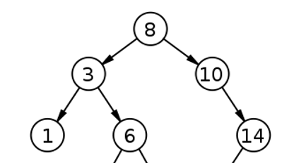

```
Ejercicio #1
Operaciones Complementarias – seudocódigo y análisis
```
## Descripción en lenguaje natural del los algoritmos solicitados
- Obtener la menor clave del árbol

Para obtener la mayor clave del árbol, teniendo el cuenta que el arbol es de busqueda, sabemos que la clave menor va a ser la que este mas abajo a la izquierda. El algoritmo verifica si el nodo actual (this) tiene un hijo derecho (hijoDer). Si no lo tiene, el nodo actual es el mayor y lo retorna. Si tiene un hijo derecho, llama recursivamente a findLargest en ese hijo. De esta forma, el método recorre el árbol hacia la derecha hasta encontrar el nodo más a la derecha, que es el mayor elemento del árbol.

- Obtener la mayor clave del árbol

Para obtener la mayor clave del árbol, teniendo el cuenta que el arbol es de busqueda, sabemos que la clave mayor va a ser la que este mas abajo a la derecha. El algoritmo verifica si el nodo actual (this) tiene un hijo izquierdo (hijoIzq). Si no lo tiene, el nodo actual es el menor y lo retorna. Si tiene un hijo izquierdo, llama recursivamente a findShortest en ese hijo. De esta forma, el método recorre el árbol hacia la izquierda hasta encontrar el nodo más a la izquierda, que es el menor elemento del árbol.

- Obtener la clave inmediata anterior a una clave dada (pasada por parámetro)

Para obtener el padre de una clave pasada por parametro lo que hicimos fue ir recorriendo el arbol desde un nodo inicial (pasado por parametro ya que es necesario para la recursividad) e ir identificando hijo izquierdo y derecho del mismo, para posteriormente comparar dichos hijos con la clave pasada por parametro. Si la clave coincide con el hijo, tenemos anteriormente el padre de la misma guardado en "inicial" y lo retornamos.

- Obtener la cantidad de nodos de un nivel dado (por parámetro)

- Listar todas las hojas cada una con su nivel

Para esto fuimos contando en un contador que incrementa en 1 cada vez que pasamos por un nivel que no tiene hoja, hasta hallar una hoja e imprimir la misma con su respectivo nivel. 

- Verificar si el árbol es de búsqueda.

Este algoritmo comprueba si un árbol binario es un árbol de búsqueda binario. Primero, si el nodo actual no tiene hijos, se considera automáticamente un BST, ya que no hay subárboles que puedan violar las reglas. Luego, el método verifica los hijos del nodo actual. Si el hijo izquierdo tiene un valor mayor o igual al del nodo actual, o si el hijo derecho tiene un valor menor o igual, el árbol no es un BST.
Posterior a eso, si el hijo izquierdo es menor, se llama recursivamente a la función dentro de *if (!hijoIzq.isItBST())*, si el resultado de isItBST es true, no entra dentro del if (por la negación), ya que si no lo hace se retorna verdadero afuera del if. Si entra significa que el resultado de la recursión fue false, ! la cambia a true, entra al if, y retorna falso. Lo mismo para el caso de si el hijo derecho es mayor.


## Identificación de precondiciones y postcondiciones correspondientes
- [**findLargest()**]{#C2EDED}

Precondiciones
```
Árbol inicializado: El árbol binario de búsqueda (BST) debe estar correctamente construido con todos los nodos correctamente enlazados.

Nodo válido: El método debe ser llamado sobre un nodo válido del árbol (this no debe ser nulo).
```
Postcondiciones
```
Elemento más grande encontrado: El método retornará el nodo que contiene el valor más grande en el subárbol que tiene como raíz el nodo desde el cual se invocó el método.

No modifica el árbol: El método no modificará la estructura del árbol ni los valores de los nodos. Solo realiza lecturas y llamadas recursivas.

Terminación correcta: El método debe finalizar cuando se alcance un nodo que no tiene hijo derecho (hijoDer es nulo), retornando dicho nodo.
```

- [**findShortest()**]{#C2EDED}

Precondiciones
```
Árbol inicializado: El árbol binario de búsqueda (BST) debe estar correctamente construido con todos los nodos adecuadamente enlazados.

Nodo válido: El método debe ser llamado sobre un nodo válido del árbol (this no debe ser nulo).
```
Postcondiciones
```
Elemento más pequeño encontrado: El método retornará el nodo que contiene el valor más pequeño en el subárbol cuya raíz es el nodo desde el cual se invocó el método.

No modifica el árbol: El método no alterará la estructura del árbol ni los valores de los nodos. Solo realiza lecturas y llamadas recursivas.

Terminación correcta: El método finalizará cuando se alcance un nodo que no tenga hijo izquierdo (hijoIzq es nulo), retornando dicho nodo.
```

- **getParent()**

Precondiciones
```
Árbol inicializado: El árbol binario de búsqueda (BST) debe estar correctamente construido con todos los nodos adecuadamente enlazados.

Nodo válido: El método debe ser llamado sobre un nodo válido del árbol (this no debe ser nulo).

Hijo a buscar válido: El nodo hijoAbuscar debe ser un nodo válido del árbol y no debe ser nulo.

Método getEtiqueta implementado: La clase del nodo (TElementoAB) debe tener implementado el método getEtiqueta, que retorna un valor comparable.

Comparabilidad de etiquetas: Las etiquetas de los nodos deben ser comparables entre sí, ya que el método usa compareTo para comparar las etiquetas.
```
Postcondiciones
```
Nodo padre encontrado: Si el nodo hijoAbuscar está en el árbol, el método retornará el nodo padre del hijoAbuscar.

Nodo no encontrado: Si el hijoAbuscar no está en el subárbol cuya raíz es el nodo desde el cual se invocó el método, el método retornará null.

No modifica el árbol: El método no alterará la estructura del árbol ni los valores de los nodos. Solo realiza lecturas y llamadas recursivas.

Terminación correcta: El método finalizará correctamente cuando se encuentre el nodo hijoAbuscar y se retorne su padre, o cuando se determine que hijoAbuscar no está en el subárbol, retornando null.
```

- **isItBST()**

Precondiciones
```
Árbol inicializado: El árbol binario debe estar correctamente construido con todos los nodos adecuadamente enlazados.

Método getEtiqueta implementado: La clase del nodo (TElementoAB) debe tener implementado el método getEtiqueta, que retorna un valor comparable.

Comparabilidad de etiquetas: Las etiquetas de los nodos deben ser comparables entre sí, ya que el método usa compareTo para comparar las etiquetas.

Nodos no nulos: Los nodos izquierdo (hijoIzq) y derecho (hijoDer), si existen, no deben ser nulos.
```
Postcondiciones
```
Verificación correcta del BST: El método retornará true si el subárbol cuya raíz es el nodo desde el cual se invocó el método cumple con las propiedades de un árbol binario de búsqueda (BST). Retornará false si no las cumple.

No modifica el árbol: El método no alterará la estructura del árbol ni los valores de los nodos. Solo realiza lecturas y llamadas recursivas.

Terminación correcta: El método finalizará correctamente después de verificar todas las condiciones necesarias en cada nodo del subárbol, asegurando que cada nodo respeta las propiedades del BST (nodos izquierdos menores que el nodo actual y nodos derechos mayores que el nodo actual).
```

- **levelAndLeaf()**

Precondiciones
```
Árbol inicializado: El árbol debe estar correctamente construido y los nodos deben estar enlazados adecuadamente.

Nivel inicial válido: El parámetro level debe ser un entero válido que representa el nivel del nodo actual. Normalmente, el método se inicia con level igual a 0 cuando se llama desde la raíz del árbol.

Método getEtiqueta definido: La clase del nodo (TElementoAB o similar) debe tener un método getEtiqueta que retorne una representación en cadena del nodo.
```
Postcondiciones
```
Recursión correcta: El método debe llamar recursivamente a sí mismo incrementando el nivel cuando el nodo actual tiene hijos.

Impresión de hojas: Para cada hoja del árbol (nodo sin hijos), el método imprimirá su etiqueta y el nivel en que se encuentra.

No modifica el árbol: El método no debe modificar la estructura del árbol ni los datos de los nodos. Solo debe realizar lecturas y llamadas recursivas.
```
## Descripción en lenguaje natural de los casos de prueba correspondientes a cada operación
En todos los tests el árbol armado es el siguiente:



- Caso de prueba **testFindLargest()**

Se crea el arbol mostrado en la imagen, se espera que el resultado que el metodo retorna sea 14. El test comprueba que el método findLargest() correctamente identifica al nodo con el valor 14 como el más grande en el árbol y compara este resultado con el valor esperado usando assertEquals.

- Caso de prueba **testFindShortest()**

Se crea el arbol mostrado en la imagen, se espera que el resultado que el metodo retorna sea 1. El test comprueba que el método findShortest() correctamente identifica al nodo con el valor 1 como el más chico en el árbol y compara este resultado con el valor esperado usando assertEquals.

- Caso de prueba **testGetParent()**

Se crea el arbol mostrado en la imagen, se espera que el resultado que el metodo retorna sea 10, ya que el nodo que se pasa como parametro es el 14. El test comprueba que el método getParent() correctamente identifica al nodo padre con el valor 10 como la clave inmediata anterior a la clave dada por parametro (14) y compara este resultado con el valor esperado usando assertEquals.

- Caso de prueba **testItIsBST()**

El método testIsItBST() verifica si un árbol binario de búsqueda (BST) está construido correctamente. Se crean varios nodos con valores específicos (1, 3, 5, 6, 10 y 14) y se estructuran de la siguiente manera:

El nodo raíz tiene el valor 5.
El nodo con valor 10 se establece como el hijo derecho de la raíz.
El nodo con valor 3 se establece como el hijo izquierdo de la raíz.
El nodo con valor 1 se establece como el hijo izquierdo del nodo con valor 3.
El nodo con valor 6 se establece como el hijo derecho del nodo con valor 3.
El nodo con valor 14 se establece como el hijo derecho del nodo con valor 10.
Luego, el método llama a isItBST() para verificar si esta estructura es un BST válido. El resultado esperado es true, indicando que el árbol cumple con las propiedades de un BST. La prueba compara este resultado con el valor esperado utilizando assertEquals.

- Caso de prueba **testItIsNotBST()**

El método testIsItBST() verifica si un árbol binario de búsqueda (BST) está construido correctamente. Se crean varios nodos con valores específicos (1, 9, 5, 6, 10 y 14) y se estructuran de la siguiente manera:

El nodo raíz tiene el valor 5.
El nodo con valor 10 se establece como el hijo derecho de la raíz.
El nodo con valor 9 se establece como el hijo izquierdo de la raíz.
El nodo con valor 1 se establece como el hijo izquierdo del nodo con valor 9.
El nodo con valor 6 se establece como el hijo derecho del nodo con valor 9.
El nodo con valor 14 se establece como el hijo derecho del nodo con valor 10.
Luego, el método llama a isItBST() para verificar si esta estructura es un BST válido. El resultado esperado es false, ya que el 9 esta incorrectamente posicionado, indicando que el árbol no cumple con las propiedades de un BST. La prueba compara este resultado con el valor esperado utilizando assertEquals.

- Caso de prueba **levelAndLeaf()**

No testeamos este metodo ya que no retorna nada (void), simplemente imprime una string con los datos.

## Escritura del algoritmo en seudocódigo formal 

- Seudocódigo **findLargest**
```
Algoritmo findLargest
    Si (hijoDer == nulo) Entonces
        retornar este
    Sino
        retornar hijoDer.findLargest()
    FinSi
FinAlgoritmo
```
- Seudocódigo **findShortest**
```
Algoritmo findShortest
    Si (hijoIzq == nulo) Entonces
        retornar este
    Sino
        retornar hijoIzq.findShortest()
    FinSi
FinAlgoritmo
```
- Seudocódigo **getParent**
```
Algoritmo getParent(hijoAbuscar: TElementoAB) -> TElementoAB
    Si (hijoAbuscar.getEtiqueta() < this.getEtiqueta()) Entonces
        Si (hijoIzq ≠ nulo Y hijoAbuscar.getEtiqueta() == hijoIzq.getEtiqueta()) Entonces
            retornar este
        Sino
            retornar hijoIzq.getParent(hijoAbuscar)
        FinSi
    FinSi
    Si (hijoAbuscar.getEtiqueta() > this.getEtiqueta()) Entonces
        Si (hijoDer ≠ nulo Y hijoAbuscar == hijoDer) Entonces
            retornar este
        Sino
            retornar hijoDer.getParent(hijoAbuscar)
        FinSi
    Sino
        retornar nulo
    FinSi
FinAlgoritmo
```
- Seudocódigo **isItBST**
```
Algoritmo isItBST() -> boolean
    Si (hijoIzq == nulo Y hijoDer == nulo) Entonces
        retornar verdadero
    FinSi
    Si (hijoIzq ≠ nulo) Entonces
        Si (hijoIzq.getEtiqueta() > this.getEtiqueta()) Entonces
            retornar falso
        Sino
            Si (NO hijoIzq.isItBST()) Entonces
                retornar falso
            FinSi
        FinSi
    FinSi
    Si (hijoDer ≠ nulo) Entonces
        Si (hijoDer.getEtiqueta() < this.getEtiqueta()) Entonces
            retornar falso
        Sino
            Si (NO hijoDer.isItBST()) Entonces
                retornar falso
            FinSi
        FinSi
    FinSi
    retornar verdadero
FinAlgoritmo
```
- Seudocódigo **levelAndLeaf**
```
Procedimiento levelAndLeaf(level: entero)
    Si (hijoIzq ≠ nulo O hijoDer ≠ nulo) Entonces
        level += 1
        Si (hijoDer ≠ nulo Y hijoIzq ≠ nulo) Entonces
            hijoIzq.levelAndLeaf(level)
            hijoDer.levelAndLeaf(level)
        Sino Si (hijoDer == nulo) Entonces
            hijoIzq.levelAndLeaf(level)
        Sino Si (hijoIzq == nulo) Entonces
            hijoDer.levelAndLeaf(level)
        FinSi
    FinSi
    Si (hijoDer == nulo Y hijoIzq == nulo) Entonces
        Escribir("La hoja " + this.getEtiqueta().toString() + " está en el nivel " + nivel)
    FinSi
FinProcedimiento
```
## Orden del tiempo de ejecución de los algoritmos

- Orden de **findLargest**
```
O(h)
```
El orden de ejecución del método findLargest() es principalmente determinado por la altura del subárbol derecho del nodo actual, siendo O(h) en el peor de los casos, donde h es la altura del subárbol.

- Orden de **findShortest**
```
O(h)
```
El orden de ejecución del método findShortest() es O(h), donde h es la altura del subárbol izquierdo del nodo actual, reflejando la necesidad de explorar el subárbol izquierdo hasta encontrar el nodo más superficial.

- Orden de **getParent**
```
O(h)
```
El orden de ejecución del método getParent(TElementoAB hijoAbuscar) es O(h), donde h es la altura del árbol, reflejando el peor caso en el que el nodo hijo buscado está en el extremo opuesto del árbol al nodo actual.

- Orden de **isItBST**
```
O(n)
```
El orden de ejecución del método isItBST() es O(n), donde n es el número total de nodos en el árbol, reflejando la necesidad de visitar cada nodo una vez para verificar la propiedad de BST.

- Orden de **levelAndLeaf**
```
O(n)
```
El orden de ejecución del método levelAndLeaf(int level) es O(n), donde n es el número total de nodos en el árbol, reflejando la necesidad de visitar cada nodo una vez para calcular y imprimir su nivel.

